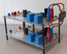

## Four-switch buck-boost converter {#fsbb}

This is a software-configurable converter that can be operated either as a buck or as a boost converter. The image below shows an experimental setup consisting of two units of the prototype, where one converter is used as a source, and the other one is used as a load. This setup can be used to test control strategies for a buck or boost converter driving an active load.

{ width="700" }
/// caption
Prototype of the four-switch buck-boost converter developed at the RPTU
///

## Isolated Ćuk converter {#cuk}

The Ćuk converter is high-order, nonlinear and nonminimum phase converter, making it a challenging converter to control. During my doctorate, I've developed a control strategy for it, and built a prototype to validate my theoretical results. The prototype is of the isolated variant and is shown below. 

- The full documentation of the board, including simulation models, can be found [here](https://mtguerreiro.github.io/pcbs/cuk_iso_ps.html).

{ width="400" }
/// caption
Prototype of the isolated Ćuk converter developed at the RPTU
///

## 700 V boost converter {#boost-700v}

I've assembled this prototype to integrate a 350 V supercapacitor bank to a 700 V dc grid, with the main goal of using the supercapacitor bank to handle power transients in the grid. During my doctorate, I've worked on a grid-forming strategy for the boost converter, and used this prototype to validate the theoretical results. The prototype consists of:

- Infineon EVAL-COOLSIC-2kVHCC evaluation board that contains the half bridge, gate drivers, and output capacitors
- Custom PCB that contains the current and voltage measurements, input and output SSRs, pre-charge and discharge, and the power inductor (WE 760801321)
- Pynq-Z2 SoC board, used for the control of the converter

{ width="500" }
/// caption
Prototype of the 700 V boost converter
///
